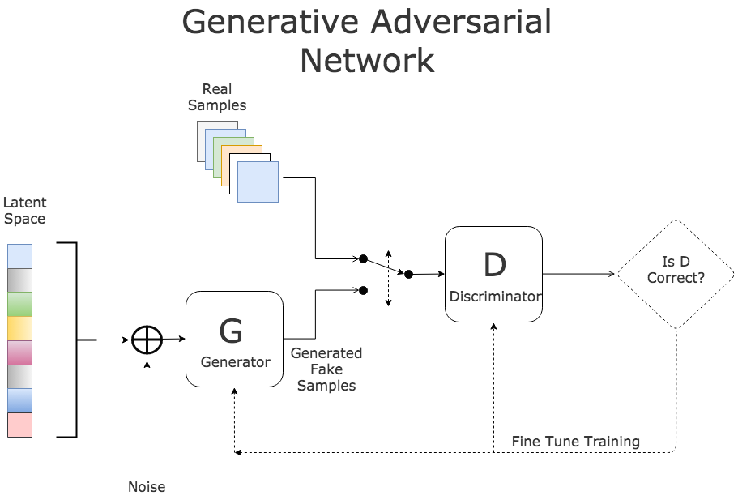

# Generating-cute-dogs
Imagine if we had access to the true data distribution *P**d**a**t**a*(*x*) we could sample from that distribution in order to generate new  samples, however there is no direct way to do this as typically this  distribution is complex and high-dimensional. What if we could instead  sample from a random noise (e.g. Normal distribution) and then learn to  transform that to *P**d**a**t**a*(*x*). Neural networks are a prime candidate to capture functions with high  complexity and we can use to to capture this transformation. This is  exactly what the do. They train the transformer network or Generator  along with another network, called the Discriminator, in a game  theoretic way. Going back to our image generation example:The Generator network (*G*), tries to fool the discriminator in thinking that the generated images are real,meaning that they are taken from *P**d**a**t**a*, and The Discriminator network (*D*), tries to differentiate between real (*x*∼*P**d**a**t**a*) and fake images.

Random noise is fed into the Generator that transforms it into a  "fake image". The Discriminator is fed both from the training set images (*p**d**a**t**a*(*x*)) and the fake images coming from the Generator and it has to tell them  apart. The idea behind GAN, is to train both of these networks  alternatively to do the best they can in generating and discriminating  images. The intuition is that by improving one of these networks, in  this game theoretic manner, the other network has to do a better job to  win the game, and that in turn improves its performance and this loop  continues.

